# AWS IoT Core and Shelly Device Setup Script

This README provides detailed information on the Bash script designed to automate the setup of AWS IoT Core and Shelly devices. The script is divided into three main phases:

- **[Phase 1: AWS CLI Setup](#phase-1-aws-cli-setup)**

- **[Phase 2: AWS IoT Core Setup](#phase-2-aws-iot-core-setup)**

- **[Phase 3: Shelly Device Setup](#phase-3-shelly-device-setup)**

Each phase is meticulously crafted to guide you through the necessary steps, ensuring a seamless setup process.

## Table of Contents

- [Overview](#overview)
- [Execution Flow Diagram](#execution-flow-diagram)
- [Prerequisites](#prerequisites)
- [Script Execution](#script-execution)
- [Phase 1: AWS CLI Setup](#phase-1-aws-cli-setup)
  - [1.1 Check and Install Prerequisites](#11-check-and-install-prerequisites)
  - [1.2 AWS CLI Installation](#12-aws-cli-installation)
  - [1.3 AWS CLI Configuration](#13-aws-cli-configuration)
- [Phase 2: AWS IoT Core Setup](#phase-2-aws-iot-core-setup)
  - [2.1 Create an IoT Thing](#21-create-an-iot-thing)
  - [2.2 Policy Management](#22-policy-management)
  - [2.3 Certificate Generation and Attachment](#23-certificate-generation-and-attachment)
  - [2.4 Retrieve MQTT Client Information](#24-retrieve-mqtt-client-information)
- [Phase 3: Shelly Device Setup](#phase-3-shelly-device-setup)
  - [3.1 Provide Shelly Device IP](#31-provide-shelly-device-ip)
  - [3.2 Firmware Check and Update](#32-firmware-check-and-update)
  - [3.3 Upload Certificates to Shelly Device](#33-upload-certificates-to-shelly-device)
  - [3.4 Configure MQTT on Shelly Device](#34-configure-mqtt-on-shelly-device)
  - [3.5 Reboot Shelly Device](#35-reboot-shelly-device)
- [Notes and Best Practices](#notes-and-best-practices)

---

## Overview

This script automates the integration of Shelly devices with AWS IoT Core by:

- Installing and configuring the AWS CLI.
- Setting up AWS IoT Core resources (Things, Policies, Certificates).
- Configuring Shelly devices to communicate with AWS IoT Core via MQTT over TLS.

---

## Execution Flow Diagram

```mermaid
flowchart TB
    %% Start and End Nodes
    A([🚀 Start Script Execution])
    E([🏁 End of Script])

    %% Phase 1 - AWS CLI Setup
    subgraph Phase1 [<b>Phase 1: AWS CLI Setup</b>]
        direction LR
        style Phase1 fill:#2E8B57,stroke:#1C5B3A,stroke-width:2px,rounded,color:#FFFFFF,font-size:14px
        B1([📦 Install Prerequisites]):::step
        B2([⬇️ Install AWS CLI]):::step
        B3([🔑 Configure AWS CLI]):::step
        B1 --> B2 --> B3
    end

    %% Phase 2 - AWS IoT Core Setup
    subgraph Phase2 [<b>Phase 2: AWS IoT Core Setup</b>]
        direction LR
        style Phase2 fill:#D2691E,stroke:#8B4513,stroke-width:2px,rounded,color:#FFFFFF,font-size:14px
        C1([🌐 Create IoT Thing]):::step
        C2([🔒 Manage Policies]):::step
        C3([📄 Generate Certificates]):::step
        C4([ℹ️ Retrieve MQTT Details]):::step
        C1 --> C2 --> C3 --> C4
    end

    %% Phase 3 - Shelly Device Setup
    subgraph Phase3 [<b>Phase 3: Shelly Device Setup</b>]
        direction LR
        style Phase3 fill:#4682B4,stroke:#2C5D7A,stroke-width:2px,rounded,color:#FFFFFF,font-size:14px
        D1([🔌 Connect to Shelly Device]):::step
        D2([🔄 Firmware Check & Update]):::step
        D3([📤 Upload Certificates]):::step
        D4([⚙️ Configure MQTT]):::step
        D5([🔁 Reboot Shelly Device]):::step
        D1 --> D2 --> D3 --> D4 --> D5
    end

    %% Main Flow Connecting Phases
    A --> Phase1
    Phase1 --> Phase2
    Phase2 --> Phase3
    Phase3 --> E

    %% Styles
    classDef step fill:#FFFFFF,stroke:#333,stroke-width:1px,rounded,color:#000
    class A,E title
    classDef title fill:#FFFFFF,stroke:#333,stroke-width:2px,rounded,font-weight:bold,font-size:16px,color:#000
```



---

## Prerequisites

Before running the script, ensure the following:

- **Operating System**: Ubuntu Linux or any Debian-based distribution.
- **User Privileges**: Root or sudo privileges are required.
- **Internet Connection**: Stable internet connection for downloading packages and communicating with AWS services.
- **AWS Account**: An active AWS account with permissions to manage IoT Core resources.
- **Shelly Device**: A Shelly device connected to the same network as the machine running the script.

---

## Required AWS Permissions

The script requires AWS permissions to create IoT Core resources. Ensure your AWS user or role has the following permissions:

- `iot:CreateThing`
- `iot:CreatePolicy`
- `iot:CreateKeysAndCertificate`
- `iot:AttachThingPrincipal`
- `iot:AttachPolicy`
- `iot:DescribeEndpoint`

---

## Script Execution

To execute the script:

1. **Clone or Download the Script**: Ensure the script is saved locally and has execute permissions.

   ```bash
   chmod +x shelly-aws-provision.sh
   ```

2. **Run the Script with Root Privileges:**

   ```bash
   sudo ./shelly-aws-provision.sh
   ```

---

## **Phase 1: AWS CLI Setup**

### 1.1 Check and Install Prerequisites

The script checks for the following essential packages:

- `curl`
- `unzip`
- `python3`
- `jq`

If any are missing, the script installs them using `apt`.

### 1.2 AWS CLI Installation

- **Check Existing Installation**: Determines if AWS CLI is already installed.
- **Upgrade Option**: If an installation is detected, the script prompts whether you would like to upgrade.
  - If **Yes**, it follows the standard process:
    - **Download Directory Prompt**: Asks for a download directory (default is the current directory).
    - **Download AWS CLI**: Downloads the AWS CLI package to the specified location.
    - **Unzip and Install**: Extracts and installs or updates the AWS CLI.
    - **Clean Up**: Removes downloaded files after installation.
  - If **No**, it skips this step and moves to the next step.

### 1.3 AWS CLI Configuration

- **Authentication Method**: Offers two methods for AWS CLI configuration:
  - **SSO** (Single Sign-On)
  - **Short-term Credentials** (Access Key and Secret Key)

---

## **Phase 2: AWS IoT Core Setup**

### 2.1 Create an IoT Thing

- **Thing Types**: Lists existing Thing Types or allows the creation of a new one.
- **Create New Thing Type**: If a new Thing Type is created, it is automatically applied to the IoT Thing being set up.
- **Thing Name**: Prompts for a name for the IoT Thing.
- **Creation**: Uses AWS CLI to create the Thing with the specified or newly created Thing Type.

### 2.2 Policy Management

- **Existing Policies**: Lists available policies.
- **Policy Creation**: If no suitable policy exists, the script creates a new one with default permissions (`iot:*` on all resources).
- **New Policy Usage**: If a new policy is created, it is automatically used in the certificate attachment steps.

### 2.3 Certificate Generation and Attachment

- **Certificate Generation**: Creates a new certificate and private key.
- **Storage Location**: Certificates are stored in a directory named after the Thing at `<current_directory>/thingname-cert`.
- **Naming Convention**: The generated files are named as follows:
  - **Device Certificate**: `deviceCert_<thing_name>.pem`
  - **Private Key**: `privateKey_<thing_name>.pem`
  - **Root CA**: `rootCA.pem`
- **Root CA Download**: Downloads the Amazon Root CA1 certificate and saves it in the same directory.
- **Attachment**:
  - **Policy Attachment**: Attaches the specified policy to the certificate.
  - **Thing Attachment**: Attaches the certificate to the IoT Thing.

### 2.4 Retrieve MQTT Client Information

Provides essential MQTT connection details:

- **Endpoint URL**
- **Client ID** (Thing Name)
- **Paths to Certificates and Keys**

---

## **Phase 3: Shelly Device Setup**

### 3.1 Provide Shelly Device IP

Prompts for the IP address of the Shelly device and verifies connectivity.

### 3.2 Firmware Check and Update

- **Version Check**: Ensures the device firmware is at least version `1.4.2`.
- **Update Process**: If outdated, the script initiates a firmware update.

### 3.3 Upload Certificates to Shelly Device

Uploads the following to the Shelly device:

- **`CA Certificate`**
- **`Device Certificate`**
- **`Private Key`**

### 3.4 Configure MQTT on Shelly Device

Configures the Shelly device to connect to AWS IoT Core via MQTT over TLS:

- **`Server Endpoint`**
- **`Client ID`**
- **`SSL/TLS Settings`**

### 3.5 Reboot Shelly Device

Reboots the Shelly device to apply the new configurations.

## Notes and Best Practices

- **Security**: The script generates policies with full permissions (iot:*). In production, restrict permissions according to the principle of least privilege.
- **AWS CLI Configuration**: Ensure the AWS CLI is configured with credentials that have the necessary permissions for IoT Core operations.
- **Shelly Device**: Verify that the device is accessible over the network and that no firewall rules block communication.
- **Data Backup**: Always back up important data before running scripts that modify system configurations.
- **Testing**: Test the script in a controlled environment before deploying it in a production setting.

## License

This project is licensed under the [Apache License 2.0](https://www.apache.org/licenses/LICENSE-2.0).

Unless required by applicable law or agreed to in writing, software distributed under the License is distributed on an **"AS IS" BASIS**, **WITHOUT WARRANTIES OR CONDITIONS OF ANY KIND**, either express or implied. See the License for the specific language governing permissions and limitations under the License.
